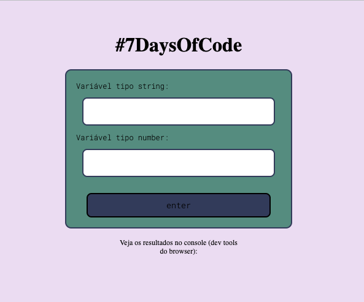
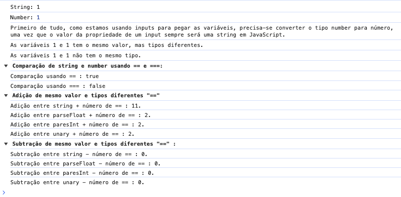

# 7DaysOfCode

## :pencil2: WIP

Um exercício, que consiste em revisar conceitos práticos importantes do JavaScript. Este repositório é inspirado pela Rafaela Ballerini. :)

### Dia 1

"Existe uma situação super comum para quem utiliza o Javascript: problemas com os tipos de variáveis na hora de comparar os valores de duas variáveis entre si. Em linguagens de programação compiladas, como Java e C#, esse problema é detectado em tempo de compilação, e você que está desenvolvendo o código tem um aviso claro do erro. Já no Javascript, esses erros passam despercebidos, já que o código não passa por um compilador. Ou seja, os erros só aparecem em tempo de execução. Isso causa alguns comportamentos estranhos, como todos esses exemplos aqui abaixo retornando true:"

    console.log( false == '0' );
    console.log( null == undefined );
    console.log( " \t\r\n" == 0 );
    console.log( ' ' == 0 );

Mas os resultados são falso positivos.

## Proposta

Com isso, alguns erros comuns foram expostos numa pequena interface, onde pode-se brincar com as duas variáveis de string e number.

## Pontos Interessantes a entender:

Se você tem um input que aceita entrada de texto (type="text") e digita um número nesse input, e também tem uma variável número e tenta realizar operações entre esses valores, pode haver comportamentos inesperados devido à natureza dinâmica e flexível do JavaScript em relação aos tipos de dados.

Quando você digita um número em um campo de texto (type="text"), mesmo que o valor seja numérico, ele é tratado como uma string pelo JavaScript. Isso pode resultar em operações de concatenação ao invés de adição, por exemplo.

Se você deseja garantir operações matemáticas apropriadas, convém converter explicitamente os valores para números antes de realizar as operações, utilizando parseInt ou parseFloat conforme necessário.

Primeiro de tudo, como estamos usando inputs para pegar as variáveis, precisa-se converter o tipo number para número também, uma vez que o valor da propriedade de um input sempre será uma string em JavaScript.

